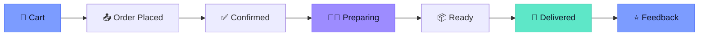

<div align="center">



<br/>


<br/><br/>

### Order food. Track it live. Learn from every customer.

*A full-stack restaurant platform that pairs simple customer ordering with a built-in CRM and analytics engine for staff.*

</div>

<br/>

---

<br/>

## 🍽️ What is FeastIQ?

Most small restaurant systems do one thing: take orders. FeastIQ does that — but also tracks *who* is ordering, *how often*, and *how happy they are* once the food arrives.

Customers browse a categorized menu, build a cart, and place an order with nothing more than an email or phone number — no account required. They watch their order move through every stage in real time, and once it's delivered, they can leave a star rating and comment.

On the other side, staff get a full back office: menu management, strict order-status control, a feedback inbox, and an analytics dashboard that segments customers into VIP / Regular / Occasional / Inactive tiers automatically — all without a single manual spreadsheet.

<br/>

## ✨ Core Capabilities

<table>
<tr>
<td width="33%" valign="top">

### 🛒 Customer Experience
- Browse menu by category
- Cart with live total updates
- Order without creating an account
- Real-time status tracking (auto-refresh every 10s)
- 1–5 star feedback after delivery

</td>
<td width="33%" valign="top">

### 🧑‍🍳 Staff Tools
- JWT-secured admin login
- Menu CRUD with soft delete
- Enforced order-status transitions
- Feedback inbox with rating filters
- Paginated list endpoints

</td>
<td width="33%" valign="top">

### 📊 CRM & Analytics
- Daily order trend (30 days)
- Peak hours analysis
- Popular items ranking
- Customer segmentation
- Loyalty & retention metrics

</td>
</tr>
</table>

<br/>

## 🔄 The Order Lifecycle



Status only ever moves forward — there's no skipping steps, and the server (not the client) owns every transition.

<br/>

## 🧬 Tech Stack

<div align="center">

| Layer | Technology | Purpose |
|:---|:---|:---|
| 🖥️ **Backend** | Python, Flask | API server, business logic |
| 🗄️ **ORM / Migrations** | SQLAlchemy, Flask-Migrate | Models, schema versioning |
| 🔐 **Auth** | Flask-JWT-Extended | Admin session tokens |
| 🌐 **CORS** | Flask-CORS | Frontend ↔ backend communication |
| 🗃️ **Database** | SQLite (swap-in PostgreSQL) | Orders, menu, feedback, customers |
| 🎨 **Frontend** | Bootstrap 5, Vanilla JS | Customer + admin pages |
| 📈 **Charts** | Chart.js | Analytics dashboard visuals |

</div>

<br/>

## 🗂️ Project Structure

```
FeastIQ/
├── backend/
│   ├── app/
│   │   ├── models/          # Database models
│   │   ├── routes/          # API endpoints
│   │   ├── services/        # Business logic
│   │   ├── config.py        # Configuration
│   │   ├── extensions.py    # Flask extensions
│   │   └── __init__.py      # App factory
│   ├── migrations/          # Database migrations
│   ├── .env                 # Environment variables
│   ├── requirements.txt     # Python dependencies
│   ├── run.py                # Flask server
│   └── seed_data.py          # Database seeding
├── frontend/
│   ├── customer/            # Customer-facing pages
│   │   ├── index.html        # Menu browsing
│   │   ├── order.html        # Cart & checkout
│   │   ├── status.html       # Order tracking
│   │   └── feedback.html     # Rating form
│   ├── admin/                # Admin dashboard
│   │   ├── login.html
│   │   ├── dashboard.html
│   │   ├── orders.html
│   │   ├── feedback.html
│   │   └── customers.html
│   └── landing.html
├── start_servers.bat
└── stop_servers.bat
```

<br/>

## 🚀 Quick Start

```bash
start_servers.bat
```
This starts the Flask backend on **port 5000** and the frontend on **port 8000**.

| Page | URL |
|---|---|
| Landing | http://localhost:8000/landing.html |
| Customer ordering | http://localhost:8000/customer/index.html |
| Admin dashboard | http://localhost:8000/admin/login.html |

Stop everything with:
```bash
stop_servers.bat
```

> ⚠️ **Default admin credentials** (`admin / admin123`, `manager / manager123`, `supervisor / super123`) are seeded for local development only. Change or remove them before deploying anywhere public.

<br/>

## 📡 API Endpoints

<table>
<tr>
<td valign="top">

**Auth**
```
POST   /auth/login
```

**Menu**
```
GET    /menu
POST   /menu
PUT    /menu
DELETE /menu
```

**Orders**
```
POST   /orders
GET    /orders
GET    /orders/<id>
PATCH  /orders/<id>/status
```

</td>
<td valign="top">

**Feedback**
```
POST   /feedback
GET    /feedback
```

**Analytics**
```
GET    /analytics/orders
GET    /analytics/feedback
GET    /analytics/segments
GET    /analytics/loyalty
```

</td>
</tr>
</table>

<br/>

## 🧠 Customer Segmentation Logic

Based on order activity in the **last 90 days**:

```
👑 VIP        → 10+ orders  OR  avg order value ≥ ₹1000
🙂 Regular    → 4–9 orders  AND avg order value ₹400–₹999
🙋 Occasional → 1–3 orders
💤 Inactive   → 0 orders
```

<br/>

## 🛡️ Business Rules Worth Knowing

- **Order totals are always calculated server-side** — the client is never trusted with pricing.
- **Unit prices are snapshotted at order time**, so a later menu price change never alters a past order.
- **Feedback is only accepted on delivered orders**, and only once per order.
- **Status transitions are strictly enforced** — no skipping from "pending" straight to "delivered."
- **All list endpoints are paginated** by default.

<br/>

---

<div align="center">

<sub>Built as a full-stack restaurant management system — customer ordering meets real CRM.</sub>

</div>
